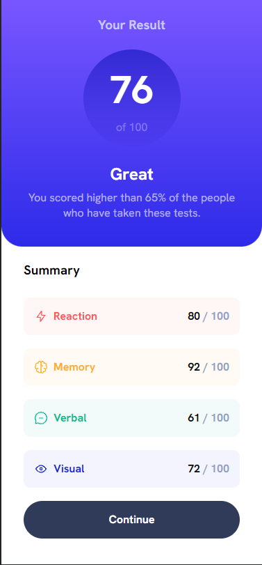
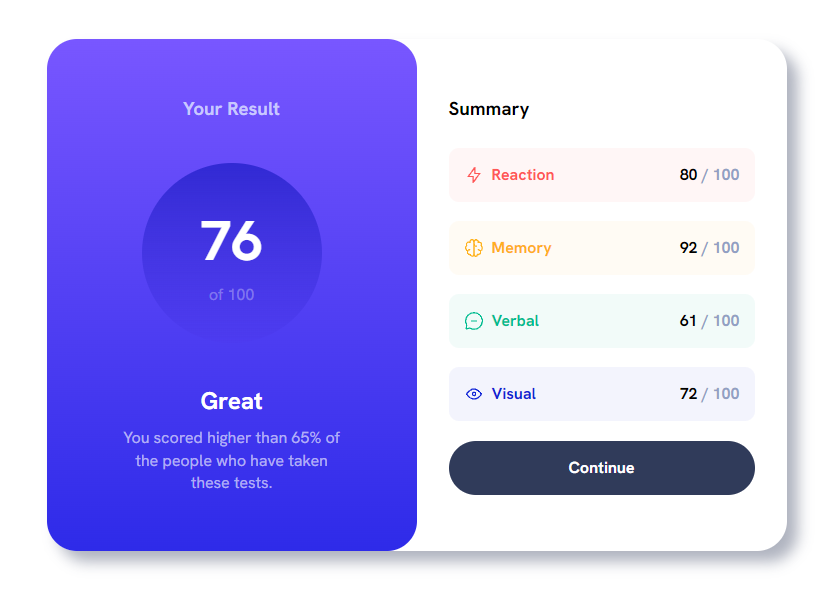

# Frontend Mentor - Results summary component solution

This is a solution to the [Results summary component challenge on Frontend Mentor](https://www.frontendmentor.io/challenges/results-summary-component-CE_K6s0maV). Frontend Mentor challenges help you improve your coding skills by building realistic projects.

## Table of contents

- [Overview](#overview)
  - [The challenge](#the-challenge)
  - [Screenshot](#screenshot)
  - [Links](#links)
- [My process](#my-process)
  - [Built with](#built-with)
  - [What I learned](#what-i-learned)

**Note: Delete this note and update the table of contents based on what sections you keep.**

## Overview

### The challenge

Users should be able to:

- View the optimal layout for the interface depending on their device's screen size
- See hover and focus states for all interactive elements on the page

### Screenshot




### Links

- Live Site URL: [LIVE SITE](https://your-live-site-url.com)

## My process

### Built with

- Semantic HTML5 markup
- CSS custom properties
- Flexbox
- CSS Grid
- Mobile-first workflow
- JS

### What I learned

Use of font-face and font-variation-settings to use variable fonts.

```css
@font-face {
  font-family: "hanken-grotesk";
  src: url("./assets/fonts/HankenGrotesk-VariableFont_wght.ttf") format("truetype");
}

.medium {
  font-variation-settings: "wght" 500;
}
.bold {
  font-variation-settings: "wght" 700;
}
.extra-bold {
  font-variation-settings: "wght" 800;
}
```
